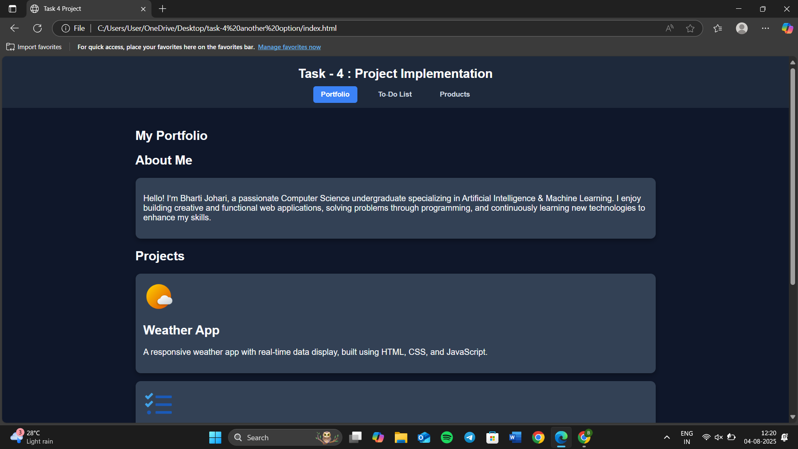
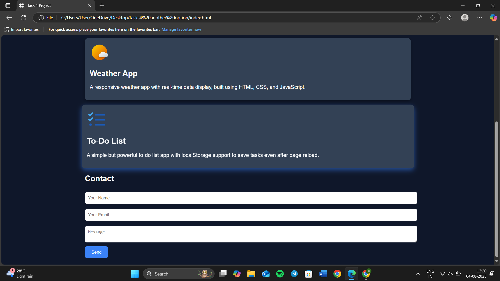
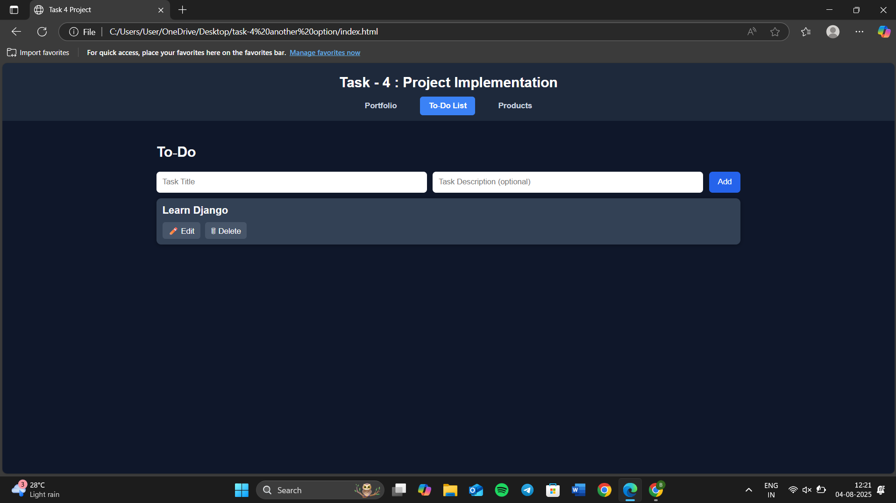
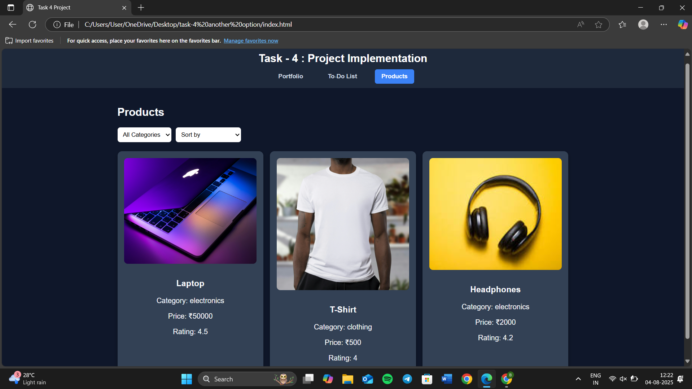

# TASK-4-WEB-DEVELOPMENT
Portfolio | To-do List | Product Carousel

 
 
  

A **multi-feature responsive web application** that showcases my **portfolio**, a **to-do list app**, and a **products section**.  
Designed with a **clean UI**, **responsive layout**, and **smooth navigation** for **ApexPlanet Software Pvt Ltd** 

---

## 📌 Live Demo
🔗 **[View Live Project](https://bharti-johari.github.io/TASK-4-WEB-DEVELOPMENT/)**

---

## ✨ Features

### **1. Portfolio Section**
- **About Me**: Introduction about my background in **AI & ML** and web development passion.
- **Projects Showcase**:
  - **Weather App** – Responsive weather app with real-time weather data using API.

### **2. To-Do List App**
- Add, delete, and mark tasks as completed.
- **Local Storage Support** – Tasks stay saved even after refreshing.

### **3. Products Section**
- Displays products in a neat, card-based layout.
- Works perfectly on **mobile and desktop**.

---

## 🛠️ Tech Stack
- **Frontend**: HTML5, CSS3, JavaScript
- **Icons**: Font Awesome / Custom Icons
- **API**: OpenWeather API (for Weather App)

---

## 📷 Screenshots

**Portfolio Page**  
---

**To-do List Page**
---

**Products Section**
---

---

## 🚀 How to Run Locally

1. **Clone the repository**
   git clone https://github.com/your-username/your-repo-name.git
2. **Open the folder**
   cd your-repo-name
3. **Run the project**
  Open index.html in your browser.

💡 Made with ❤️ by Bharti Johari • [LinkedIn](https://www.linkedin.com/in/bharti-johari-607324301/)

